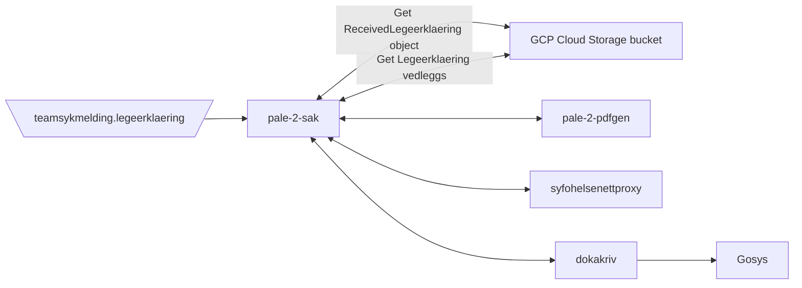

[](https://github.com/navikt/pale-2-sak/workflows/Deploy%20to%20dev%20and%20prod/badge.svg)

# Legeerklæringer journaling
This is a simple application who takes the legeerklæring document, generates a PDF and sends it to Joark to
persist it

## Technologies used
* Kotlin
* Gradle
* Ktor
* Jackson
* Junit

#### Requirements

* JDK 17

## FlowChart
This the high level flow of the application


#### Build and run tests
To build locally and run the integration tests you can simply run
``` bash
./gradlew shadowJar
 ```
or on windows 
`gradlew.bat shadowJar`

### Upgrading the gradle wrapper
Find the newest version of gradle here: https://gradle.org/releases/ Then run this command:

``` bash
./gradlew wrapper --gradle-version $gradleVersjon
```

### Contact

This project is maintained by [navikt/teamsykmelding](CODEOWNERS)

Questions and/or feature requests? Please create an [issue](https://github.com/navikt/pale-2-sak/issues)

If you work in [@navikt](https://github.com/navikt) you can reach us at the Slack
channel [#team-sykmelding](https://nav-it.slack.com/archives/CMA3XV997)